<!-- Please do not change this html logo with link -->

# I2C Slave Mode pH Sensing using PIC16F15245

The 'pic16f15245-i2c-slave-ph-sensor' code example highlights the use of the PIC16F15245 micrcontroller to read a pH sensor using the Analog-to-Digital Converter (ADC), and transmit the sensor data using the Master Syncronous Serial Port (MSSP) in I2C Slave mode. The example also allows the user to transmit the sensor data through the Enhanced Universal Syncronous Asyncronous Receiver Transmitter (EUSART) module for testing purposes.

## Related Documentation

- [PIC16F15245 Enhanced Mid-Range 8-bit Microcontroller Product Page](https://www.microchip.com/wwwproducts/en/PIC16F15245)
- [PIC16F15245 I2C Slave with Temp Sensor Code Example](https://github.com/microchip-pic-avr-examples/pic16f15245-i2c-slave-temp-sensor.git)
- [PIC16F15245 I2C Master Code Example](https://github.com/microchip-pic-avr-examples/pic16f15245-i2c-master-ph-temp.git)
- [AN3538 - A Simple Water Monitoring System with I2C Communication](https://www.microchip.com/wwwappnotes/appnotes.aspx?appnote=en1002965)

## Software Used

- MPLAB® X IDE 5.40 or newer [(microchip.com/mplab/mplab-x-ide)](http://www.microchip.com/mplab/mplab-x-ide)
- MPLAB® XC8 2.20 or newer compiler [(microchip.com/mplab/compilers)](http://www.microchip.com/mplab/compilers)
- MPLAB® Code Configurator (MCC) 3.95.0 or newer [(microchip.com/mplab/mplab-code-configurator)](https://www.microchip.com/mplab/mplab-code-configurator)
- MPLAB® Code Configurator (MCC) Device Libraries PIC10 / PIC12 / PIC16 / PIC18 MCUs [(microchip.com/mplab/mplab-code-configurator)](https://www.microchip.com/mplab/mplab-code-configurator)
- Microchip PIC16F1xxxx Series Device Support (1.4.119) or newer [(packs.download.microchip.com/)](https://packs.download.microchip.com/)

## Hardware Used

- [PIC16F15245](https://www.microchip.com/wwwproducts/en/PIC16F15245) 20-Lead PDIP Micrcontroller
- Curiosity Low Pin Count (LPC) Development Board - Rev4 [(DM164137)](https://www.microchip.com/DevelopmentTools/ProductDetails/DM164137)
- Atlas Scientific [Gravity Analog pH Sensor/Meter](https://www.atlas-scientific.com/product_pages/gravity/gravity_ph.html)
- Atlas Scientific [Consumer Grade pH Probe](https://www.atlas-scientific.com/product_pages/probes/c-ph-probe.html)
- Atlas Scientific [pH 4.0 Calibration Fluid](https://www.atlas-scientific.com/product_pages/chemicals/ph4.html)
- Atlas Scientific [pH 7.0 Calibration Fluid](https://www.atlas-scientific.com/product_pages/chemicals/ph7.html)
- Distilled Water
- Micro-USB to USB 2.0 cable
- Jumper wires

## Setup

1. Remove R49, which is located on the bottom of the Curiosity LPC board as shown in Figure 1.
  ##### Figure 1: R49
  

2. Place the PIC16F15245 micrcontroller into the 20-pin socket of the Curiosity Low Pin Count (LPC) Development Board as shown in Figure 2.

  ##### Figure 2: Curiosity LPC Development Board
  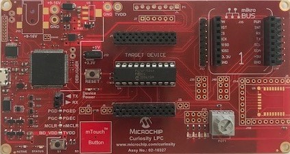

2. Connect a jumper wire from pin RB7 to the header pin labeled 'TX' as shown in Figure 3.

  ##### Figure 3: Jumper Wire from RB7 to TX
  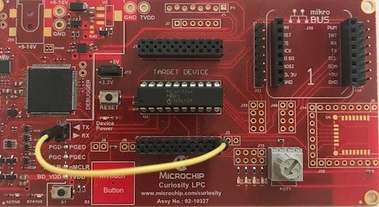

3. Connect the Gravity board (see Figure 4):
   1. Connect the '+' terminal on the Gravity board to the VDD pin on the Curiosity board.
   2. Connect the '-' terminal on the Gravity board to the VSS pin on the Curiosity board.
   3. Connect the 'A' terminal on the Gravity board to pin RA2 on the Curiosity board.

  ##### Figure 4: Gravity Board Connections
  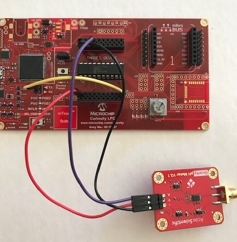

4. Connect the pH probe to the Gravity board (see Figure 5).

  ##### Figure 5: pH Probe Connection
  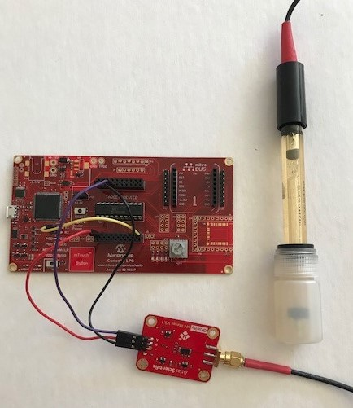

5. Connect the Curiosity LPC board to a PC using the Micro-USB to USB 2.0 cable.
6. Program the PIC16F15245 Microcontroller:
   1. If not already on your system, download and install MPLABX IDE version 5.40 (or newer).
   2. If not already on your system, download and install the XC8 C-Compiler version 2.20 (or newer).
   3. Open the 'pic16f15245-i2c-slave-ph-sensor.X' project as shown in Figure 6.

    ###### Figure 6: Open the Project In MPLABX
    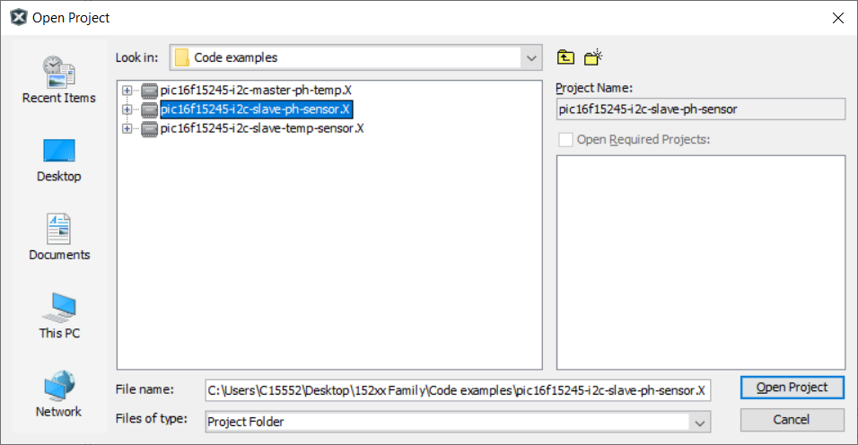

   4. Press the 'Project Properites' button to open the Project Properties window. Select the Curiosity tool from the Tools drop-down menu as shown in Figure 7.

    ###### Figure 7: Select the LPC from Tools Menu
    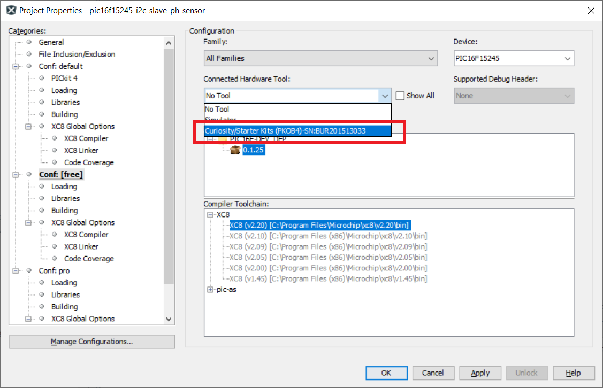

   5. Press the 'Make and Program Device' button to program the PIC (see Figure 8). Verify that the device was successfully programmed (see Figure 9).

    ###### Figure 8: Make and Program Device Button
    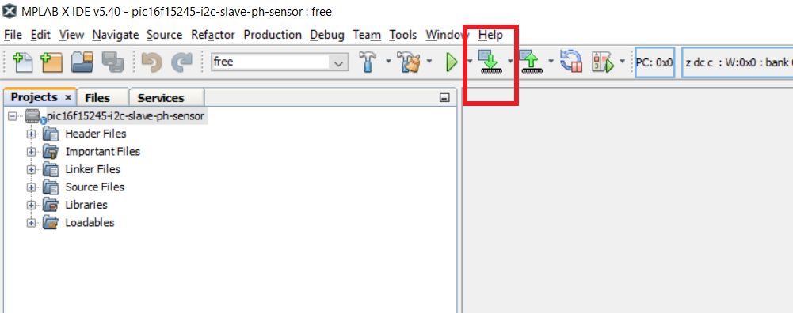

    ###### Figure 9: Device Programming Successful
    

7. Open and configure a PC terminal program, such as Tera Term:
   1. Select the USB port associated with the LPC board as shown in Figure 10.

    ###### Figure 10: Select USB Port
    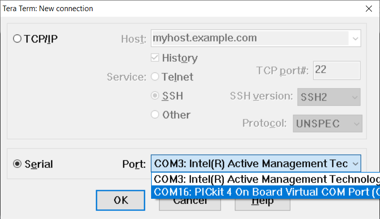

   2. Configure the serial port as shown in Figure 11.

    ###### Figure 11: Serial Port Configuration
    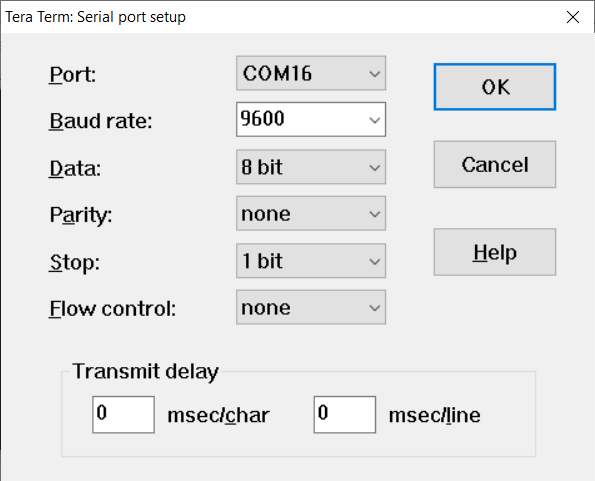

## Operation

The code example is configured such that the pH value is transmitted over the EUSART to the PC terminal program for viewing. Figure 12 shows the default main() loop, with the 'printf' statement actively transmitting the data to the PC.

##### Figure 12: Main() Default Configuration
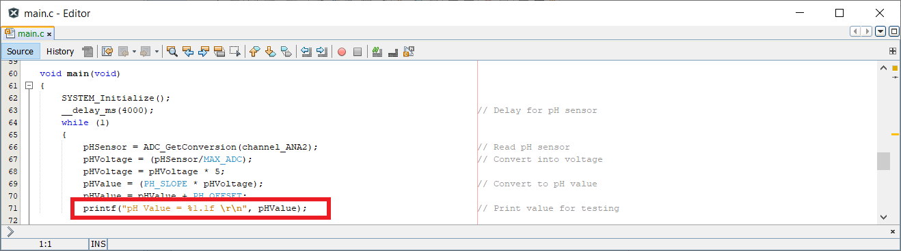

The pH probe comes with the probe tip stored in a bottle of storage solution. The storage solution has an approximate pH value of 3.8. If the probe is left in the storage solution, the PC terminal program will show a value of 3.8 - 4.0 as shown in Figure 13.

##### Figure 13: Storage Solution pH value
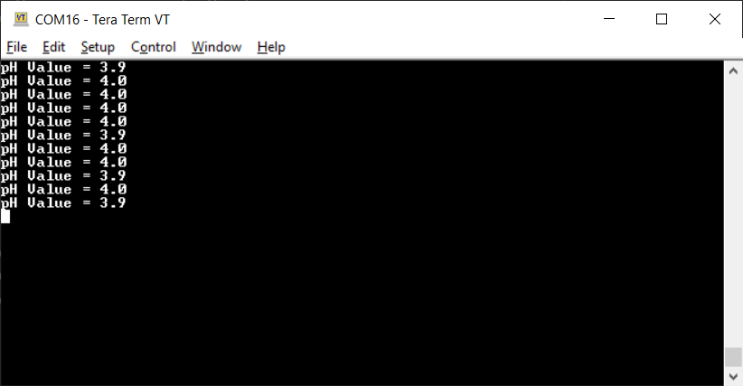

The probe can also be calibrated using the Atlas Scientific calibration fluid as shown in Figure 14. Remove the probe from the storage solution, rinse the tip in distilled water, and place the probe in one of the solutions. If using the pH 4.0 solution, the readings displayed in the terminal program window will show approximately 4.0, while if using the pH 7.0 solution, the readings will show approximately 7.0. It is important to note that whenever the probe is not in use, it MUST be stored in the storage solution. Damage to the probe will result if the sensor is not kept wet at all times.

##### Figure 14: pH Calibration Fluids

The code example can be modified to be used as an I2C slave. The snippet provided in Figure 15 shows the code required to convert the 24-bit floating-point temperature value into three unsigned 8-bit values, then load the values into an array that will be read when the I2C bus master requests the information. To use the I2C functions, uncomment the code shown in Figure 15, and comment out the highlighted 'printf' statement shown in Figure 12.

##### Figure 15: Main() Inactive I2C Slave Code
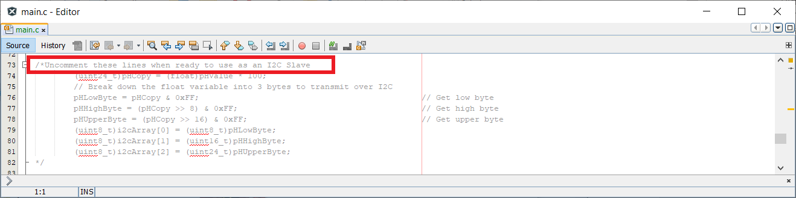

The code example can also be modified such that the values that are expected to be displayed by the I2C Master can be calculated and displayed on your PC. The snippet in Figure 16 shows the inactive code that the I2C Master would use to 'rebuild' the pH data. To use these functions, uncomment the code shown in Figure 16, while leaving the lines of code from Figure 15 uncommented. The PC terminal program will then display the pH data as observed from the Master's perspective.

##### Figure 16: Inactive Master Test Code
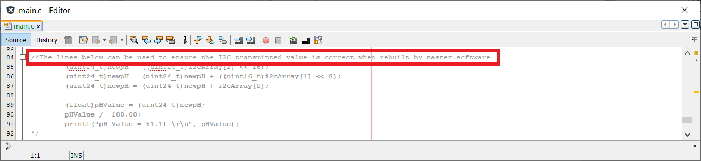

## Summary

The 'pic16f15245-i2c-slave-ph-sensor' code example highlights the use of the PIC16F15245 micrcontroller to read a pH sensor. The example defaults to transmitting the pH data through the EUSART, but can easily be modified to use as an I2C Slave. The example can also be combined with the code examples listed in the 'Related Documents' section of this readme file to create a commplete I2C Master/Slave bus.
